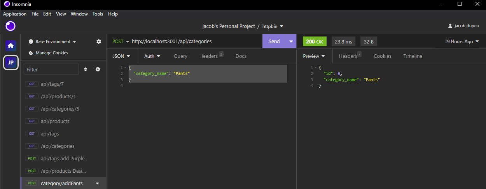

<h1 align="center">Jacobs-orm-backend</h1> 

## Description

completed back end for an e-commerce business model. I started with some starter code then was tasked with filling out the routes as well as the models. It wasnt super challenging but just took some time getting names down correctly.
## Table of Contents

- [Description](#description)
- [Installation](#installation)
- [Photos](#photos)
- [Usage](#usage)
- [Credits](#credits)
- [License](#license)

## Installation

steps required
install inquirer at version 8.2.4, and set up database config variables in a .env file.

## Photos

## Usage

This project can assist in providing a basic understanding of ORMs and backend routes. It's suitable for learning or for practical use as an e-commerce website with a built front-end.

[Watch the Demonstration Video](https://drive.google.com/file/d/1GCdhLonQt7MkJk-AOaMEkYXtpr4FKxCd/view)

## Credits

thanks to,
https://github.com/coding-boot-camp/fantastic-umbrella
for the starter code.

## License
refer to repo for licenses
license is a MIT license.

## Badges

<h2 align="center">Features</h2>
Users can do all crud operations on the database, and a specific id can be requested for more specific editing.

<h2 align="center"> How to Contribute</h2>
Fork the repository and make suggestions.

<h2 align="center">Tests</h2>

<h2 align="center">Questions</h2>
reach my git hub profile at (https://github.com/DupeaJ)
  
If you have additional questions you can reach me at jacobdupea@gmail.com
